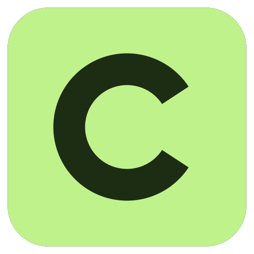
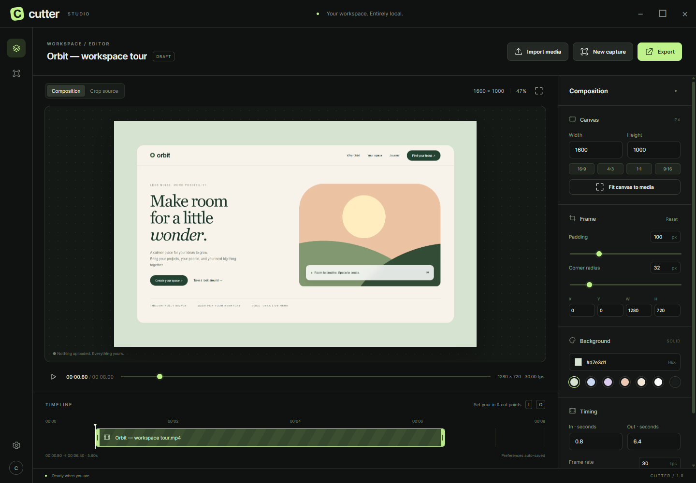
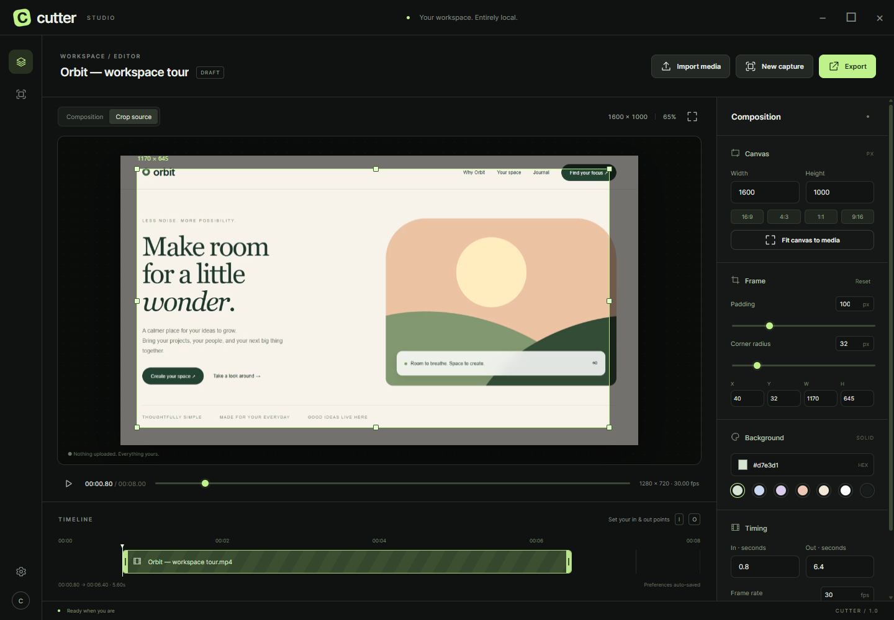
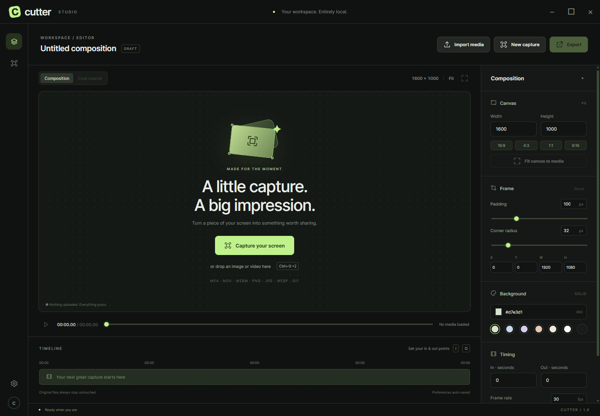

<p align="center"></p>
<h1 align="center">Cutter</h1>
<p align="center"><strong>A little capture. A big impression.</strong></p>
<p align="center">An open-source screen capture and composition studio by <a href="https://github.com/apkeo">Apkeo</a>.<br>Capture a moment, perfect the frame, and make it worth sharing.</p>

<p align="center">
  <a href="https://github.com/apkeo/cutter/releases/latest"></a>
  <a href="LICENSE"></a>
  
  <a href="https://github.com/apkeo/cutter/actions/workflows/release.yml"></a>
</p>



## Download

**[Get Cutter 1.3 →](https://github.com/apkeo/cutter/releases/latest)**

| Platform | Installer | Portable |
| --- | --- | --- |
| **Windows 10/11** · x64 | [Download .exe](https://github.com/apkeo/cutter/releases/latest/download/Cutter-1.3.0-win-x64.exe) | [Download .zip](https://github.com/apkeo/cutter/releases/latest/download/Cutter-1.3.0-win-x64.zip) |
| **macOS 13+** · Apple Silicon | [Download .dmg](https://github.com/apkeo/cutter/releases/latest/download/Cutter-1.3.0-mac-arm64.dmg) | [Download .zip](https://github.com/apkeo/cutter/releases/latest/download/Cutter-1.3.0-mac-arm64.zip) |
| **macOS 13+** · Intel | [Download .dmg](https://github.com/apkeo/cutter/releases/latest/download/Cutter-1.3.0-mac-x64.dmg) | [Download .zip](https://github.com/apkeo/cutter/releases/latest/download/Cutter-1.3.0-mac-x64.zip) |

No account. No subscription. No upload. FFmpeg is included; nothing else to install.

On macOS, drag Cutter from the DMG into Applications. These builds are **unsigned and not Apple-notarized**, so your operating system may ask you to confirm the first launch. See [first-launch help](#first-launch).

## From screen to something shareable

### 01 · Catch the moment

Press **Ctrl+Shift+2** on Windows or **Cmd+Shift+2** on macOS. Draw your region, move it into place, and resize it from any edge or corner. Take a screenshot or start a recording. Your original saves immediately, before you touch the editor.

Already have the perfect shot? Drop an image or video straight from Explorer or Finder into Cutter.

### 02 · Make the frame yours

Give a capture breathing room with padding, choose a background by hex, and dial in the corner radius — in actual output pixels. Set your canvas dimensions, use an aspect-ratio preset, or fit the composition to the current crop in one click.



### 03 · Keep only the good part

Drag the timeline handles or enter exact in/out times. Use **I** and **O** at the playhead to set your cut. Choose a composition frame rate that never exceeds the original recording's FPS.

### 04 · Export. Copy. Share.

Render an image or video, then **copy the file**, **copy its path**, or **reveal it in Explorer/Finder**. Original media stays untouched. Your crop, canvas, background, radius, timing and last project are remembered for next time.

## Thoughtfully small. Surprisingly capable.

| Capture | Compose | Export |
| --- | --- | --- |
| Custom global shortcut | Visual crop with eight handles | PNG, JPEG, WebP |
| Resizable screen region | Canvas width & height | MP4, MOV, WebM, GIF |
| Screenshot or recording | Padding & pixel corner radius | Keep or mute imported audio |
| Per-monitor selection | Hex background colors | Progress & cancellation |
| Automatic original-file saving | Trim & source-limited FPS | File and path clipboard actions |
| Remembered region | English & Polish UI | Local processing throughout |

<details>
<summary><strong>A quiet workspace, ready when you are</strong></summary>



</details>

These screenshots are captured from the actual application using the original [Orbit demo](docs/demo/orbit.html), not interface mockups.

## Formats

**Image input:** PNG, JPEG, WebP, BMP, TIFF, AVIF.  
**Video input:** MP4, MOV, WebM, MKV, AVI, M4V and animated GIF.  
**Image output:** PNG, JPEG and WebP.  
**Video output:** MP4/MOV with H.264, WebM with VP9, and GIF.

Codec support depends on the file's contents, not just its extension. Less common formats get a cached preview; export reads your original. Video exports may add one pixel to an odd canvas edge for codec compatibility. GIF uses centisecond timing and has no audio.

Screen recordings capture **video only**. Audio already present in imported videos is preserved in MP4, MOV and WebM exports.

## First launch

- **Windows:** install the `.exe`, or extract the entire portable `.zip` and run `Cutter.exe`. SmartScreen may show an unsigned-app prompt.
- **macOS:** move Cutter to Applications. If Gatekeeper blocks first launch, go to **System Settings → Privacy & Security → Open Anyway**. There is no need to disable Gatekeeper globally.
- **macOS screen capture:** allow Cutter under **Privacy & Security → Screen & System Audio Recording**, then restart the app. Screen-permission consent requires your interaction and cannot be approved by the release runner.
- **Save location:** `Videos/Cutter` on Windows and `Movies/Cutter` on macOS. Change the folder, shortcut, capture FPS and language in Settings.
- **Stopping a recording:** use the floating Stop control or press the capture shortcut again. When no control can fit outside your selected region, use the shortcut.

## Development

Vue **3.5.42**, TypeScript, Electron **44**, Vite and SCSS. Every Vue component uses `<script setup lang="ts">`, followed by `<template>` and `<style lang="scss">`. Node is pinned in `.tool-versions` and managed through **mise**.

```sh
git clone https://github.com/apkeo/cutter.git
cd cutter
mise install
mise exec -- npm ci
mise exec -- npm run dev
```

```sh
mise exec -- npm run build      # Typecheck and production build
mise exec -- npm test           # Composition and export tests
mise exec -- npm run dist:win   # Build on Windows
mise exec -- npm run dist:mac   # Build on macOS
```

TypeScript 6.0.3 is pinned for compatibility with current `vue-tsc`. See [development notes](docs/DEVELOPMENT.md) for architecture and integration tests.

## Releases

GitHub Actions builds native Windows x64, macOS ARM64 and macOS Intel packages. It verifies the packaged app and media exports on each runner. Tags such as `v1.3.0` publish a release **only after all three platform jobs pass**, with downloadable installers, portable archives and SHA-256 checksums.

## Contributing

Found a rough edge? [Open an issue](https://github.com/apkeo/cutter/issues). Include your operating system, app version, source format and steps to reproduce. Small, focused pull requests are welcome; see [CONTRIBUTING.md](CONTRIBUTING.md).

## License

**GPL-3.0-or-later** — free to use, study, modify and redistribute under the license terms. © 2026 Apkeo and contributors. See [LICENSE](LICENSE) and [third-party notices](THIRD_PARTY_NOTICES.md).

<p align="center">Made with care by <a href="https://github.com/apkeo">Apkeo</a>.</p>

To verify picker movement on a workstation with two connected displays, run `mise exec -- node tests/picker.cjs` after building.

### Precision editing

Crop with a 12× pixel magnifier, source coordinates and edge guides. Cutter analyzes the current image or paused video frame and snaps to nearby horizontal and vertical edges. Hold **Alt** to bypass snapping, or switch it off in the crop toolbar.

Set each corner radius independently. The center link preserves proportions: changing 8 px to 16 px doubles linked 16 px corners to 32 px. When the edited corner starts at zero, Cutter applies an additive change until a ratio exists.

Click or drag anywhere on the lower timeline or ruler to scrub. Drag the trim handles to edit the export range; releasing a handle keeps the preview at that boundary. Left/right arrow keys step through video frames.

### Recorded cursor layers

Enable **Hide system cursor** in the picker before recording for a clean, replaceable cursor. Cutter always records pointer positions, arrow/text/hand states, and left/right/middle button transitions while recording. The original video and a matching `.cutter.json` file are saved together; keep both files together when moving or importing a recording.

Two aligned timeline rows let you show/hide the pointer and click effects independently. Select a position or click to edit its time, coordinates, cursor shape, button or hold duration. Clicks show an expanding ring; the mouse badge highlights each button for its full hold duration. **Smooth** applies a cubic interpolated path with tremor reduction and exact click anchors. All these effects appear in exported videos too, and original telemetry is preserved separately from edits.

Recordings with the real cursor enabled retain that cursor in their pixels; the editor cannot remove a cursor already baked into a video. Imported videos without a sidecar have no recorded cursor data. Unrecognized custom cursor artwork falls back to an arrow and can be corrected on the timeline.

On macOS, allow **Screen Recording** and **Input Monitoring** for Cutter in System Settings → Privacy & Security. Cursor tracking observes mouse events only, starts with recording preparation, and stops when recording stops. Screen recording uses ScreenCaptureKit with explicit system-cursor visibility control.
